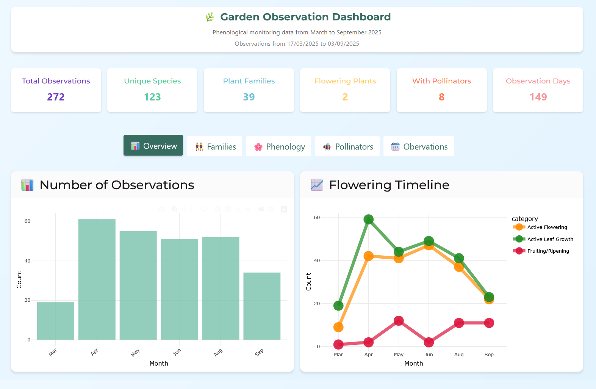
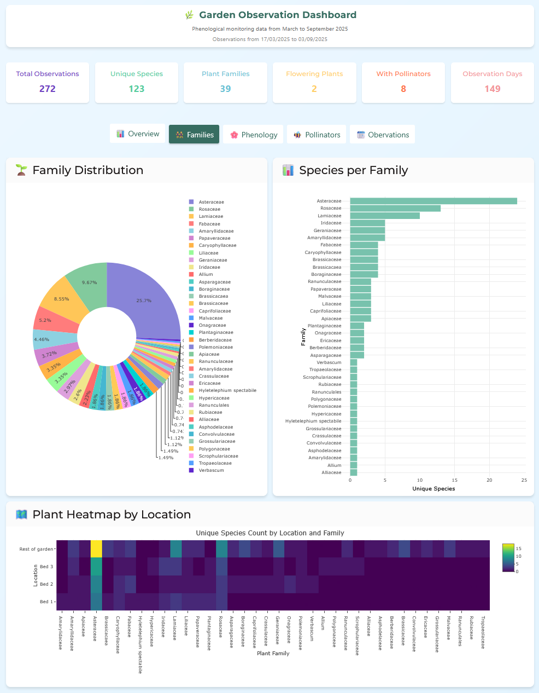
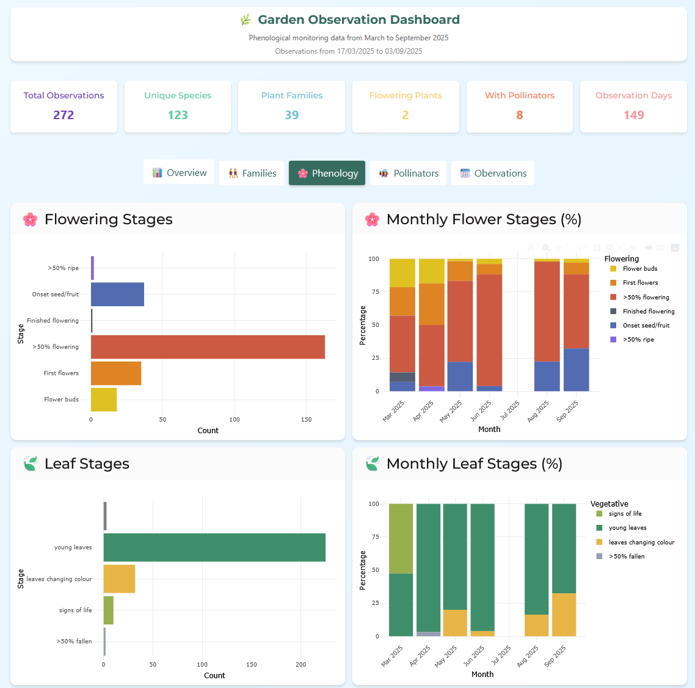
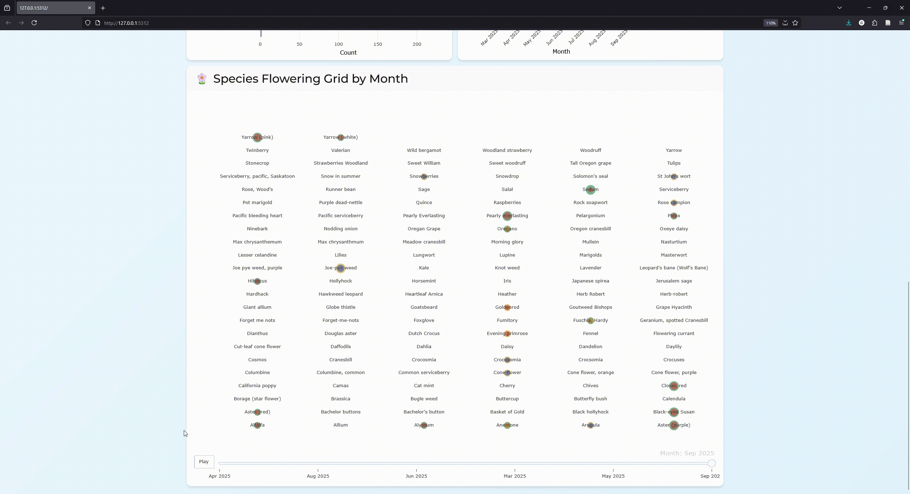
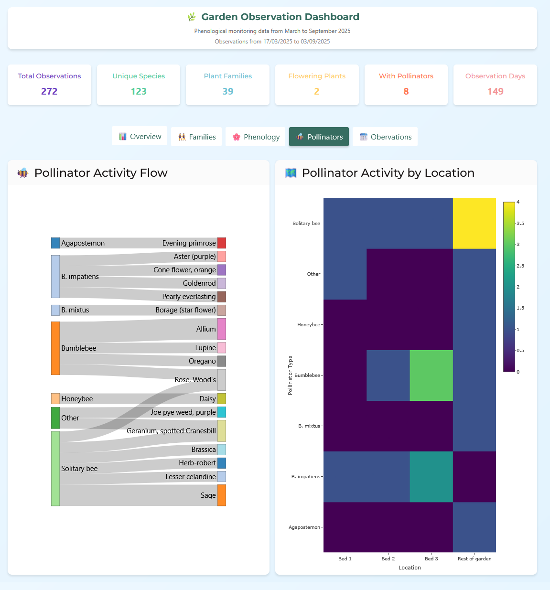
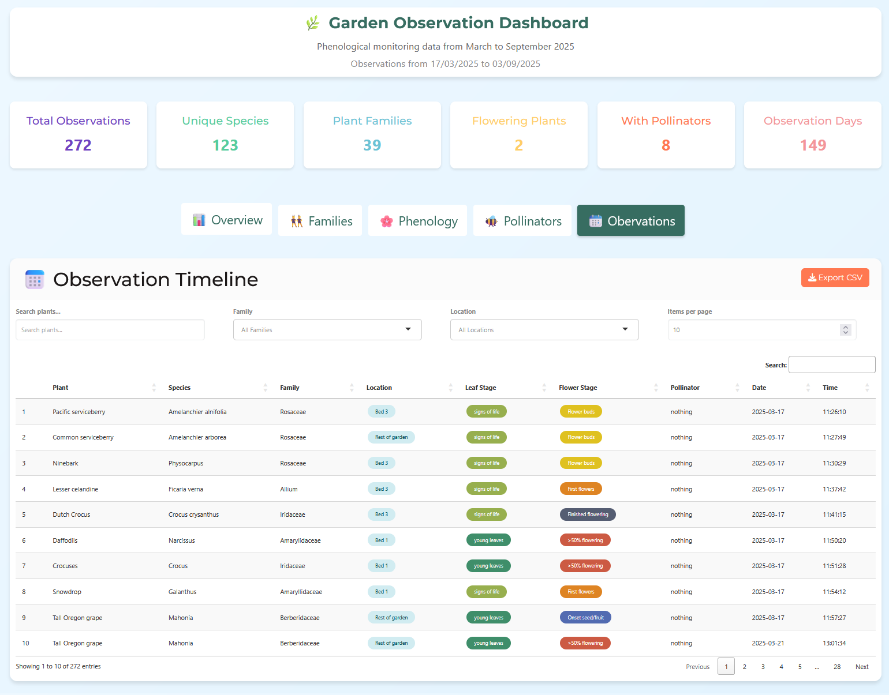

# 🌿 Pollinator Garden Dashboard

A Shiny web application for visualizing and analyzing phenological observations from a pollinator garden. This interactive dashboard provides comprehensive insights into plant flowering patterns, leaf development, pollinator activity, and seasonal trends.

Explore the data! [https://harrig12.shinyapps.io/garden_dashboard/](https://harrig12.shinyapps.io/garden_dashboard/)

## ✨ Preview

### 📊 Overview Tab
- Monthly observation counts and activity patterns
- Flowering timeline tracking active flowering and fruiting stages
- Summary statistics including total observations, unique species, and pollinator activity

### 👯 Plant Families Tab
- Family distribution visualization with interactive pie charts
- Species count per plant family analysis
- Location-based plant family heatmap showing species diversity

### 🌸 Phenology Tab
- Flowering stage progression tracking
- Monthly flowering stage percentages with interactive stacked charts
- Leaf development stage monitoring
- Species flowering grid with animated monthly progression (up to 136 species)

### 🐝 Pollinators Tab
- Sankey flow diagram showing pollinator-plant relationships
- Location-based pollinator activity heatmaps
- Pollinator diversity analysis

### 📆 Observations Tab
- Searchable and filterable observation timeline
- Export functionality for filtered data
- Detailed plant information with visual stage indicators

